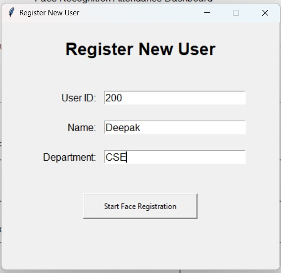

# Biometric Attendance System

A desktop-based biometric attendance system built using Python, OpenCV, SQLite, and Tkinter.

## Features

- Face-based user registration
- Automatic face image capture
- LBPH face recognition
- Automatic model training
- Multi-frame identity verification
- One attendance record per user per day
- Registered users management
- Attendance records with search and date filtering
- CSV export
- Desktop GUI dashboard
- Live date and time
- User and attendance statistics

## Technologies Used

- Python
- OpenCV
- Tkinter
- SQLite
- NumPy

## Installation

1. Create and activate a virtual environment.

2. Install dependencies:

```bash
pip install -r requirements.txt
```

## Images

### Main Dashboard


### Registration


### Registered Users


### Attendance Records
